## Part 1. Настройка gitlab-runner

- Поднять виртуальную машину Ubuntu Server 20.04 LTS

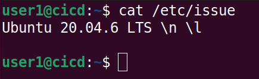 

- Скачать и установить на виртуальную машину gitlab-runner

``curl -L https://packages.gitlab.com/install/repositories/runner/gitlab-runner/script.deb.sh | sudo bash``

``sudo apt install gitlab-runner``

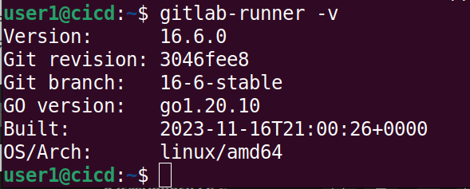 

- Запустить gitlab-runner и зарегистрировать его для использования в текущем проекте (DO6_CICD)

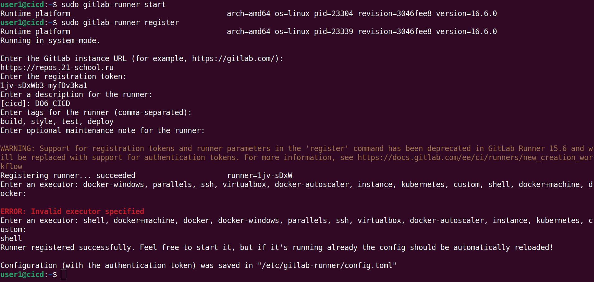 

## Part 2. Сборка

- Написать этап для CI по сборке приложений из проекта C2_SimpleBashUtils: запуск сборки через мейк файл, артефакты на 30 дней (файл gitlab-ci.yml).

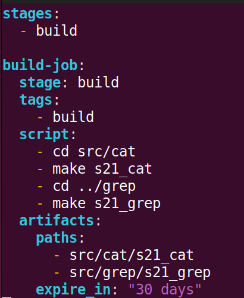 

---

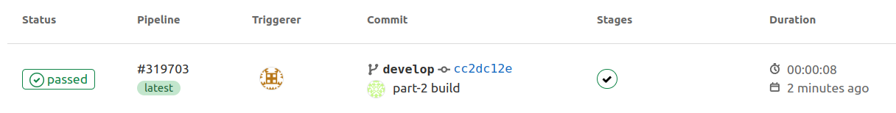 

---

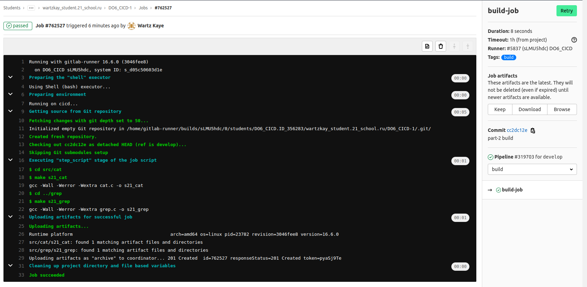 

## Part 3. Тест кодстайла

- Написать этап для CI, который запускает скрипт кодстайла (clang-format)

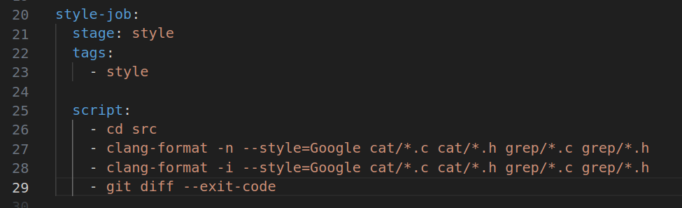

---

---

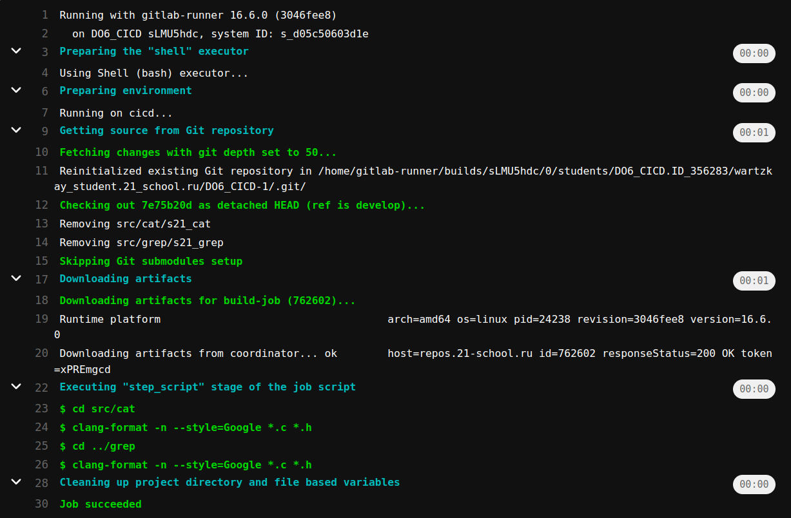 

- Если кодстайл не прошел, то "зафейлить" пайплайн

 

- В пайплайне отобразить вывод утилиты clang-format

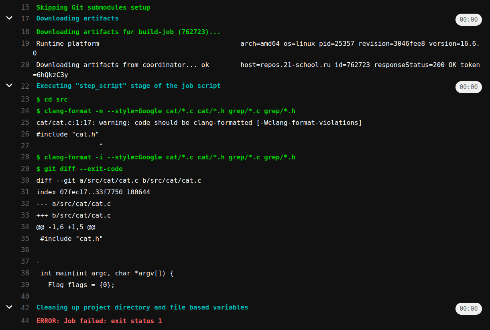 

## Part 4. Интеграционные тесты

- Написать этап для CI, который запускает ваши интеграционные тесты из того же проекта

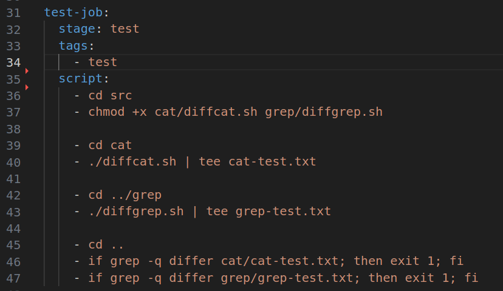 

- Запускать этот этап автоматически только при условии, если сборка и тест кодстайла прошли успешно

 

---

- Если тесты не прошли, то "зафейлить" пайплайн

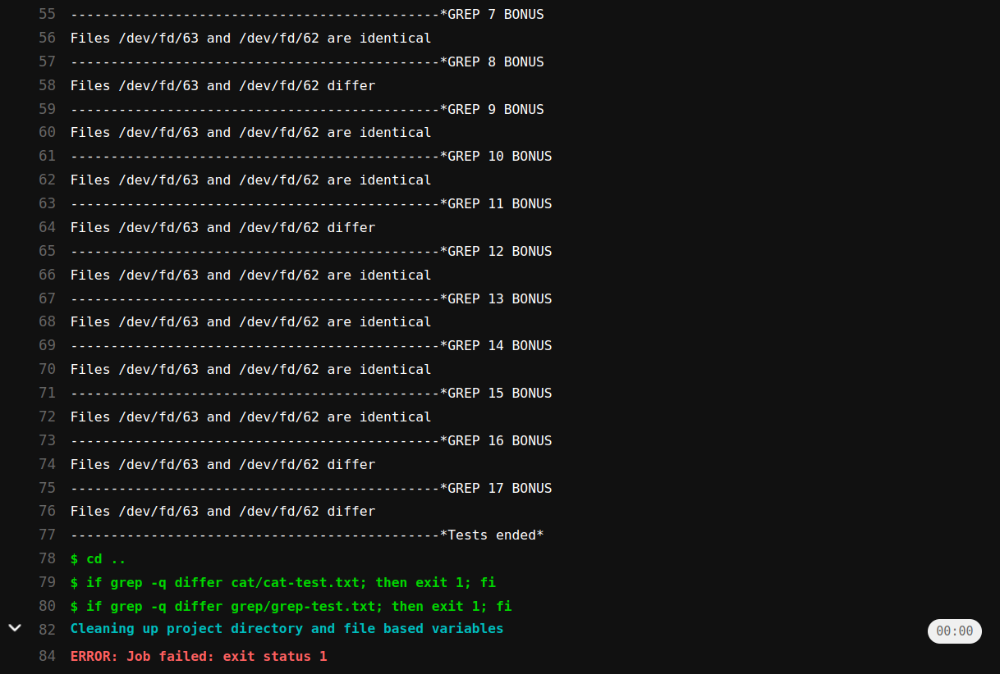 

- В пайплайне отобразить вывод, что интеграционные тесты успешно прошли / провалились

 

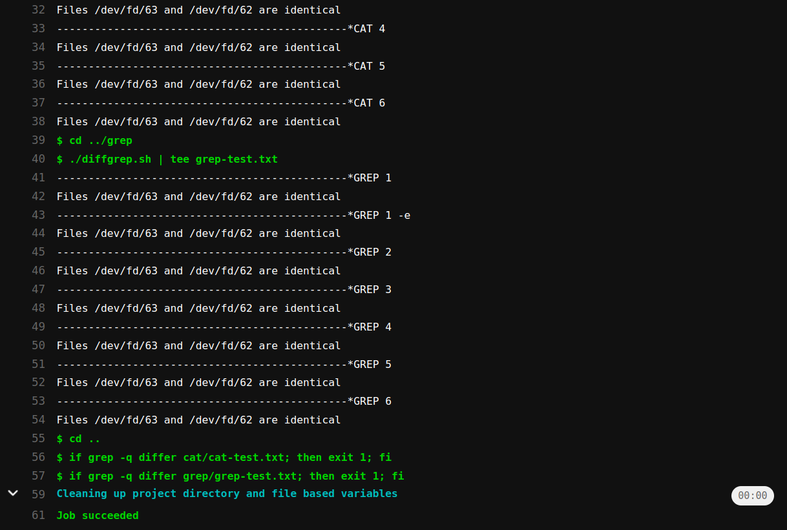 
