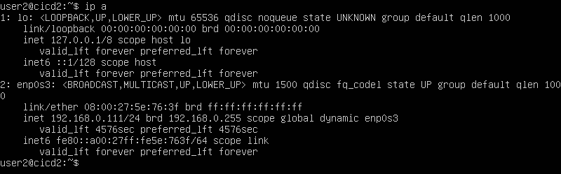
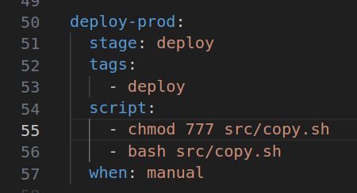
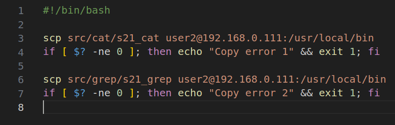
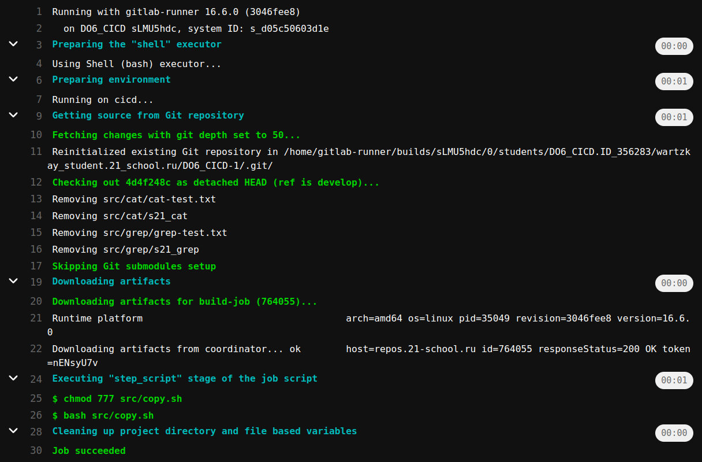
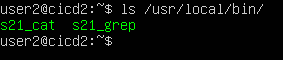
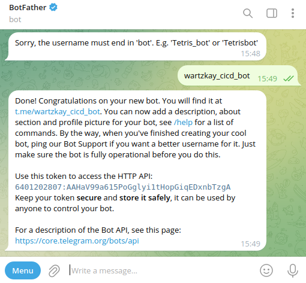
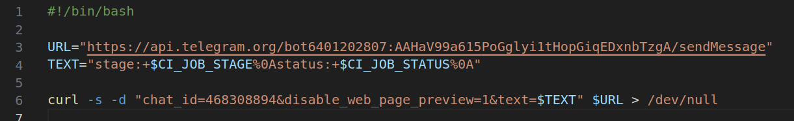
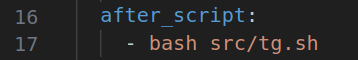
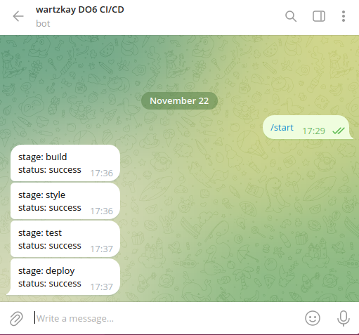

## Part 1. Настройка gitlab-runner

- Поднять виртуальную машину Ubuntu Server 20.04 LTS

 

- Скачать и установить на виртуальную машину gitlab-runner

``curl -L https://packages.gitlab.com/install/repositories/runner/gitlab-runner/script.deb.sh | sudo bash``

``sudo apt install gitlab-runner``

 

- Запустить gitlab-runner и зарегистрировать его для использования в текущем проекте (DO6_CICD)

 

## Part 2. Сборка

- Написать этап для CI по сборке приложений из проекта C2_SimpleBashUtils: запуск сборки через мейк файл, артефакты на 30 дней (файл gitlab-ci.yml).

 

---

 

---

 

## Part 3. Тест кодстайла

- Написать этап для CI, который запускает скрипт кодстайла (clang-format)

---

---

 

- Если кодстайл не прошел, то "зафейлить" пайплайн

 

- В пайплайне отобразить вывод утилиты clang-format

 

## Part 4. Интеграционные тесты

- Написать этап для CI, который запускает ваши интеграционные тесты из того же проекта

 

- Запускать этот этап автоматически только при условии, если сборка и тест кодстайла прошли успешно

 

---

- Если тесты не прошли, то "зафейлить" пайплайн

 

- В пайплайне отобразить вывод, что интеграционные тесты успешно прошли / провалились

 

 

## Part 5. Этап деплоя 

- Поднять вторую виртуальную машину Ubuntu Server 20.04 LTS

 

- Написать этап для CD, который "разворачивает" проект на другой виртуальной машине

 

- Запускать этот этап вручную при условии, что все предыдущие этапы прошли успешно

 

- Написать bash-скрипт, который при помощи ssh и scp копирует файлы, полученные после сборки (артефакты), в директорию /usr/local/bin второй виртуальной машины

 

На первой машине прописать: ``sudo su, passwd gitlab-runner, ssh-keygen, ssh-copy-id user2@192.168.0.111`` \
На второй машине прописать: ``sudo chmod -R 777 /usr/local/bin``

- Результат:

---

--- 

## Part 6. Дополнительно. Уведомления

- Создать бота в tg с помощью BotFather

- Написать скрипт, который уведомляет об успешном/неуспешном выполнении пайплайна

- Добавить вызов скрипта в ``after_script`` каждой стадии в ``.gitlab-ci.yml``

- Результат

